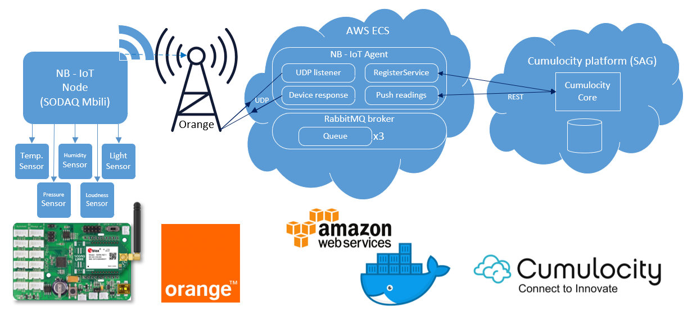
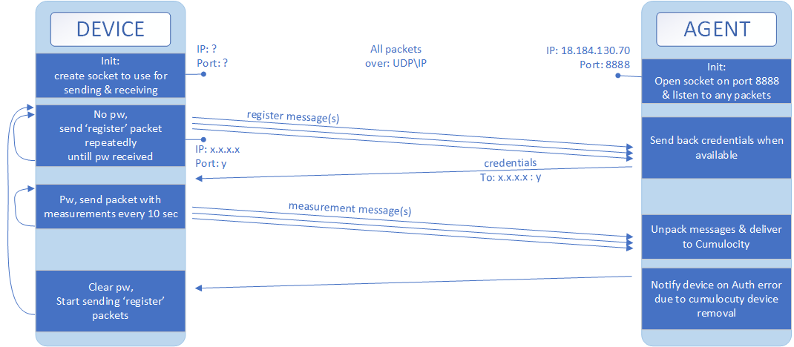

# Index
 * In this readme:
	 * [Introduction](#introduction)
	 * [What's in this project?](#whats-in-this-project)
		 * [General diagram](#general-diagram)
			 * [General explanation](#general-explanation)
		 * [Communication between the device and the agent](#communication-between-the-device-and-the-agent)
		 * [Components](#components)
			 * [NB-IoT node (SODAQ Mbili)](#nb-iot-node-sodaq-mbili)
			 * [NB-IoT Agent](#nb-iot-agent)
			 * [Cumulocity platform](#cumulocity-platform)
			 * [Cumulocity REST api](#cumulocity-rest-api)
			 * [Cumulocity Core](#cumulocity-core)
	 * [NB-IoT](#nb-iot)
	 * [Usage Instructions](#usage-instructions)
	 * [Future Goals](#future-goals)
	
 * Setting up the development environment
	 * [Introduction](install/developmentDesktop#introduction)
	 * [Usage](install/developmentDesktop#usage)
		 * [Prerequisites](install/developmentDesktop#prerequisites)
	 * [Vagrant](install/developmentDesktop#vagrant)
		 * [Introduction](install/developmentDesktop#introduction)
		 * [Pre-requisites](install/developmentDesktop#pre-requisites)
		 * [Basics](install/developmentDesktop#basics)
		 * [Known issues](install/developmentDesktop#known-issues)
			 * [VirtualBox Guest Additions installation fails](install/developmentDesktop#virtualBox-guest-additions-installation-fails)
			 * [Copy/Paste from guest to host or vice versa via clipboard doesn't work](install/developmentDesktop#copypaste-from-guest-to-host-or-vice-versa-via-clipboard-doesnt-work)
			 * [Mouse input on the graphical user interface of the vm stops working](install/developmentDesktop#mouse-input-on-the-graphical-user-interface-of-the-vm-stops-working)
	 * [Integrated Development Environments (IDE)](install/developmentDesktop#integrated-development-environments-ide)
		 * [Java](install/developmentDesktop#java)
		
 * Creating a new Cumulocity tenant
	 * [Cumulocity (trial) Tenant](install/cumulocityTenant#cumulocity-trial-tenant)
	 
 * Building the Agent
	 * [NB_IoT-Agent](src/NB-IoT_agent#nb-iot-agent)
		 * [Technologies used](src/NB-IoT_agent#technologies-used)
		 * [Issues](src/NB-IoT_agent#issues)
		 * [Requirements](src/NB-IoT_agent#requirements)
		 * [Deployment](src/NB-IoT_agent#deployment)
		 
 * What is AWS ECS and how does it work
	 * [AWS ECS Cluster](install/aws/ecs#aws-ecs-cluster)
		 * [Requirements](install/aws/ecs#requirements)
		 * [Setting up AWS ECS](install/aws/ecs#setting-up-aws-ecs)
		 
 * Deploying the RabbitMQ broker
	 * [RabbitMQ-broker deployment using ECS](install/aws/ecs/rabbitmq-broker#rabbitmq-broker-deployment-using-ecs)
		 * [Requirements](install/aws/ecs/rabbitmq-broker#requirements)
		 * [Deployment](install/aws/ecs/rabbitmq-broker#deployment)
		 * [RE-Deployment](install/aws/ecs/rabbitmq-broker#re-deployment)
			* [To be noted](install/aws/ecs/rabbitmq-broker#to-be-noted)
			
 * Deploying the NB-IoT Agent
	 * [NB-IoT_Agent deployment using ECS](install/aws/ecs/nb-iot-agent#nb-iot-agent-deployment-using-ecs)
		 * [what is AWS ECS & how do i set it up](install/aws/ecs/nb-iot-agent#what-is-aws-ecs-how-do-i-set-it-up)
		 * [Requirements](install/aws/ecs/nb-iot-agent#requirements)
		 * [Deployment](install/aws/ecs/nb-iot-agent#deployment)
		 * [RE-Deployment](install/aws/ecs/nb-iot-agent#re-deployment)
			* [To be noted](install/aws/ecs/nb-iot-agent#to-be-noted)
			
 * Build & Deploy of the NB-Iot Node
	 * [NB-IoT_node](src/NB-IoT_node#nb-iot-node)
		 * [Options on how to update "Over The Air"](src/NB-IoT_node#how-can-it-be-updated-over-the-air)
		 * [Sodaq deployment](src/NB-IoT_node#sodaq-deployment)
			 * [Add SODAQ to device list](src/NB-IoT_node#add-sodaq-to-device-list)
			 * [Upload program to sodaq](src/NB-IoT_node#upload-program-to-sodaq)
		 * [Node configuration](src/NB-IoT_node#node-configuration)
		 * [Sources](src/NB-IoT_node#sources)
		 
 * Device Registration
	 * [Registering a Device on Cumulocity](install/deviceRegistration/README.md#registering-a-device-on-cumulocity)
		 * [Requirements](install/deviceRegistration/README.md#requirements)
		 * [Registration Steps](install/deviceRegistration/README.md#registration-steps)
	
 * FOTA, Firmware Over The Air & bootloader
	 * [possibility of ArduinoATMEGA1284P OTA updating](src/NB-IoT_node/ArduinoATMEGA1284P.md)
		* [Bootloader](src/NB-IoT_node/ArduinoATMEGA1284P.md#bootloader)
			* [What is a bootloader?](src/NB-IoT_node/ArduinoATMEGA1284P.md#what-is-a-bootloader)
			* [How to burn a new bootloader?](src/NB-IoT_node/ArduinoATMEGA1284P.md#how-to-burn-a-new-bootloader)
			* [Alternative (outdated) way of burning a bootloader without the use of a programmer](src/NB-IoT_node/ArduinoATMEGA1284P.md#alternative-outdated-way-of-burning-a-bootloader-without-the-use-of-a-programmer)
		* [Burning sketches with an external programmer without the need of a bootloader.](src/NB-IoT_node/ArduinoATMEGA1284P.md#burning-sketches-with-an-external-programmer-without-the-need-of-a-bootloader)
		* [The default bootloader on our SODAQ Mbili ATMEGA1284P board](src/NB-IoT_node/ArduinoATMEGA1284P.md#the-default-bootloader-on-our-sodaq-bili-tmega1284p-board)
		* [Custom bootloaders to flash sketch from sources other than the USB serial](src/NB-IoT_node/ArduinoATMEGA1284P.md#custom-bootloaders-o-flash-sketch-from-sources-other-than-the-usb-serial)
			* [thseiler/avr/2boots](src/NB-IoT_node/ArduinoATMEGA1284P.md#thseileravr2boots)
			* [osbock/avr_boot](src/NB-IoT_node/ArduinoATMEGA1284P.md#osbockavr_boot)
			* [mharizanov/avr_boot](src/NB-IoT_node/ArduinoATMEGA1284P.md#mharizanovavr_boot)
			* [bootdrive](src/NB-IoT_node/ArduinoATMEGA1284P.md#bootdrive)
			* [mihaigalos/miniboot](src/NB-IoT_node/ArduinoATMEGA1284P.md#mihaigalosminiboot)
			* [zevero/avr_boot](src/NB-IoT_node/ArduinoATMEGA1284P.md#zeveroavr_boot)
		* [Software resetting the arduino:](src/NB-IoT_node/ArduinoATMEGA1284P.md#software-resetting-the-arduino)
		* [Using a JUMPER, doing Over The Air programming using ubee module](src/NB-IoT_node/ArduinoATMEGA1284P.md#using-a-jumper-doing-over-the-air-programming-using-ubee-module)
		* [Other sources](src/NB-IoT_node/ArduinoATMEGA1284P.md#other-sources)
		* [Similar topics about this issue](src/NB-IoT_node/ArduinoATMEGA1284P.md#similar-topics-about-this-issue)

# Introduction
  
This project implements a weather station, based on an Arduino devkit, that syncs data to Software AG Cumulocity over the Orange NB-IoT network. It is similar to the [sag-c8y-lora-demo project](https://gitlab.com/i8c/sag/sag-c8y-lora-demo/tree/sodaq-lorank-aws-cumulocity), but uses NB-IoT instead of LoRa. It's the result  of Brent Swaenen's internship @ i8c during the spring of 2019.  
  
DISCLAIMER: Internship projects are offered for demonstration purposes only and are provided "as is." We make no warranty that internship projects are error-free. Your use of internship projects for any other purposes is at your own risk. DO NOT USE THIS PROJECT IN A PRODUCTION ENVIRONMENT! Further instructions on terms and conditions for use, reproduction, and distribution can be found in the [Apache License Version 2.0 LICENSE file](LICENCE).
  
[:top:](#)

# What's in this project?

## General diagram

### General explanation
Above, you see the different components of this project. In the following table you'll see the general purpose of each part. These will be explained in more detail down below. 

| Component | Purpose |
|---|---|
| **Sensors** | Provides the data you need to capture. |
| **NB-IoT Node**| Reads the sensor values and sends out NB-IoT packets. |
| **Orange Antenna** | Receives the NB-IoT packets and forwards them to the Agent on AWS ECS.  |
| **AWS ECS** | Manages the containers that run the Agent, Broker and workers.  |
| **AWS ECS: NB-Iot Agent** | Routes the packets around to and from the device, broker and cumulocity.  |
| **AWS ECS: RabbitMQ Broker** | A broker to queue all messages between the Agent and the workers.  |
| **Cumulocity Core** | Receives the data from the Agent, cumulocity will respond with credentials on register, or store and visualise the data when pushing the measurement. |
  
[:top:](#)

## Communication between the device and the agent:
This diagram shows the entire flow in more detail.

  
[:top:](#)

## Components

### NB-IoT node (SODAQ Mbili)

The NB-IoT node contains a SODAQ Mbili board with and attached uBlox SaraN211 NB-IOT module. 
This is an arduino compatible board made for easy prototyping. 
Arduino comes with a big variety of opensource libraries to make programming easier.

The following modules are connected in this project: 
 * TPH-board rev.4 : A sensor board for measuring Temperature(-40°C~+80°C), Pressure(300~1100hPa) and the Humidity(0~100%).(TPH)
 * Grove - Air quality sensor v1.3: Measures indoor air quality. Detects carbon monoxide, alcohol, acetone, thinner, formaldehyde and other slightly toxic gasses.
 * Grove - Light Sensor v1.2: Measures the intensity of light. The light sensor value reflects an approximated trend of light intensity.
 * Grove - PIR Motion sensor: Detects motion in a 0.1-6m range with a detection radius of 120 degrees.
 * Grove - Loudness Sensor v0.9b: Measures sounds in the environment(50~2000Hz, -48~66dB). The loudness sensor output reflects an approximated trend of loudness intensity.
 * uBlox SaraN211 NB-IOT module: Used for NB-iot communication.
 * Orange NB-Iot SIM: Allows NB-Iot communication with the Orange Antenna's.

### NB-IoT Agent

This agent will run on [AWS ECS](https://eu-central-1.console.aws.amazon.com/ecs/home?region=eu-central-1#/clusters), Amazon Web Services, Elastic Container Service.
It will run the Agent Docker container that reads the packets that were sent by the NB-IoT node module. 
It will then convert these packets into the different sensors' values and put them all in a json format to send to cumulocity.

### Cumulocity platform
[Cumulocity](http://www.cumulocity.com) is an IOT platform from Software AG. This platform is used to capture, store and visualise the data from this project.

### Cumulocity REST api

The cumulocity REST api will receive data from the NB-IoT_agent which it will then store.

### Cumulocity Core

The stored data will be used in graphs and other means to visualise data.
  
[:top:](#)

# NB-IoT
The internship will make use of an All Things Talk devkit.
The existing LoRa devkits of the [sag-c8y-lora-demo project](https://gitlab.com/i8c/sag/sag-c8y-lora-demo/tree/sodaq-lorank-aws-cumulocity) project are reused, 
only the LoRa modem is replaced by an [NB-IoT modem](https://shop.sodaq.com/sodaq-sara-ubee-n211.html). 
This is the same modem as for the [standard NB-IoT devkit](https://orange-iotshop.allthingstalk.com/product/orange_nb-iot_rdk/?v=d3dcf429c679). 
This modem requires an [Orange NB-IoT Sim Card](https://orange-iotshop.allthingstalk.com/product/nb-iot-plus/?v=d3dcf429c679).
  
[:top:](#)

# Usage Instructions

This wizard will help you configure, build & deploy from start to finish:  

1. [Set up the development desktop environment using vagrant](install/developmentDesktop)  
To build & test the solution, please make use of this development desktop VM. It contains all the development tools and prerequisites.

2. [Set up a new Cumulocity (trial) tenant](install/cumulocityTenant).  
During the development of this project, a Cumulocity tenant was created for this internship at https://i8c-nb-iot.cumulocity.com. 
This tenant is a sub-tenant of https://i8c.cumulocity.com. 
Please replace this URL with the URL of your trial tenant in the configuration files.

3. [Set up, Build & Deploy the NB-Iot Agent](src/NB-IoT_agent)  
This agent routes the data produced by the devices to the Cumulocity platform.

4. [Set up, Build & Deploy the NB-IoT node](src/NB-IoT_node)  
The devices run this code to read out the sensors values and send it as measurement data to Cumulocity via the NB-IoT Agent.
  
5. [Registering a Device on Cumulocity](install/deviceRegistration/README.md#registering-a-device-on-cumulocity)  
  
  
[:top:](#)

# Future goals:

* OTA updating:  
	esp32 example: https://randomnerdtutorials.com/esp32-over-the-air-ota-programming/  
	issues: https://arduino.stackexchange.com/a/45710  
	optional bootloader to make it possible: https://bitbucket.org/talk2/talk2boot  
* Using PSM:  
	Power Save Mode: http://forum.sodaq.com/t/power-save-mode/2095  
* CoAp:  
	java server: https://github.com/apache/camel/blob/master/components/camel-coap/src/main/docs/coap-component.adoc  
	device commands: (10. page 21) https://www.u-blox.com/sites/default/files/SARA-N2-Application-Development_AppNote_%28UBX-16017368%29.pdf#29
	
[:top:](#)
