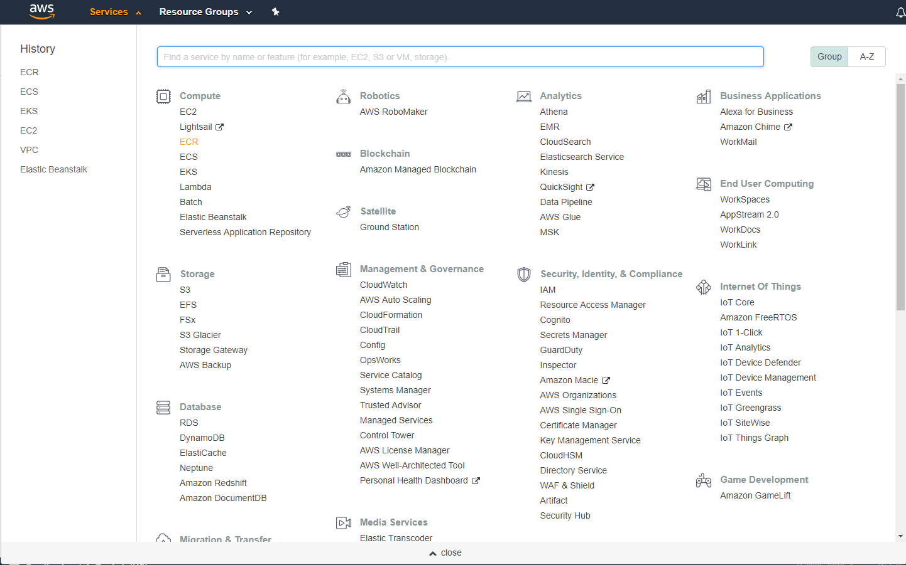
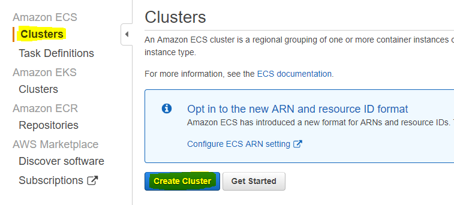

<!-- <wizard> -->
| [&laquo; Back: CumulocityTenant](../../cumulocityTenant/README.md) | [HOME](/README.md) |  [Next: rabbitmq-broker deployment &raquo;](rabbitmq-broker/README.md)
| :----------- | :-----------: | -----------: |
<!-- <\wizard> -->
# Index
 * [AWS ECS Cluster](#aws-ecs-cluster)
 * [Setting up AWS ECS](#setting-up-aws-ecs)
     * [Automated](#automated)
     * [Manually](#manually)

# AWS ECS Cluster
ECS, short for Elastic Container Service is an AWS service that will manage your docker images for you. In ECS you can create a Cluster with Services that keep Tasks alive, one Task equals to one running docker container. Each Service in the cluster can be set up to run a configured amount of Tasks, other settings like auto-scaling also exist.  

# Setting up AWS ECS
## Automated
Run the auto-deploy scripts in [./rabbitmq-broker](./rabbitmq-broker) and in [./nb-iot-agent](./nb-iot-agent) and let them create and setup the cluster.
  
- Warning: the auto-deploy scripts make use of the default vpc and default subnet. If these don't exist because you're using an old AWS account, a vpc and subnet will be created.
  
## Manually
For those that want to do it manually:  
1. Go to AWS ECS:  
	
2. Go to "clusters" and click on "Create Cluster":
	
3. "Networking Only" and click "next":  
	
4. Fill in "sag-c8y-nb-iot-demo" as clustername and check "Create VPC":  
	
  
[:top:](#)
<!-- <wizard> -->
| [&laquo; Back: CumulocityTenant](../../cumulocityTenant/README.md) | [HOME](/README.md) |  [Next: rabbitmq-broker deployment &raquo;](rabbitmq-broker/README.md)
| :----------- | :-----------: | -----------: |
<!-- <\wizard> -->
