<!-- <wizard> -->
| [&laquo; Back: rabbitmq-broker deployment](../rabbitmq-broker/README.md) | [HOME](/README.md) | [Next: NB_IoT node &raquo;](../../../../src/NB-IoT_node/README.md)
| :----------- | :-----------: | -----------: |
<!-- <\wizard> -->
# Index
 * [NB-IoT_Agent deployment using ECS](#nb-iot_agent-deployment-using-ecs)
     * [Automated](#automated)
     * [Manually](#manually)
 * [RE-Deployment](#re-deployment)
     * [To be noted](#to-be-noted)

# NB-IoT_Agent deployment using ECS
## Automated
Launch [the agent auto-deploy.sh script](./auto-deploy.sh) (**skip the AWS ECS cluster requirement**: it creates it for you)
which creates the AWS ECS cluster, the docker images, repositories, tasks, services and opens webpage to the task running the image. 
You'll be able to see the public ip and logs (other tab) after clicking on the task itself ("Task", not the "Task definition").
  
- Warning: the auto-deploy scripts make use of the default vpc and default subnet. If these don't exist because you're using an old AWS account, a vpc and subnet will be created.
  
## Manually	
Follow the following steps to deploy the agent manually:

0. Make sure you did the following commands in a terminal in [the NB-IoT_Agent folder (src/NB-IoT_agent)](src/NB-IoT_agent)  
	```mvn clean; mvn package```
1. Go to AWS ECR:  
	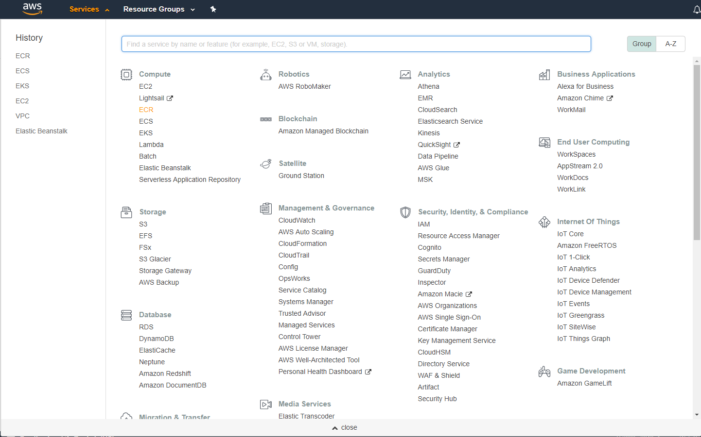
2. Click on "Create Repository":  
	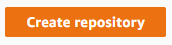
3. Create a repository 'sag-c8y-nb-iot-demo-agent':  
	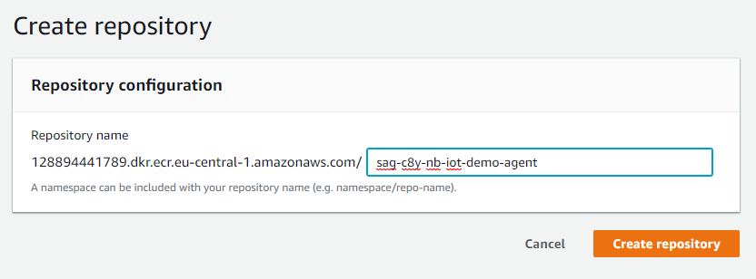
4. In the repository list click on your repositories and click on "view push commands":  
	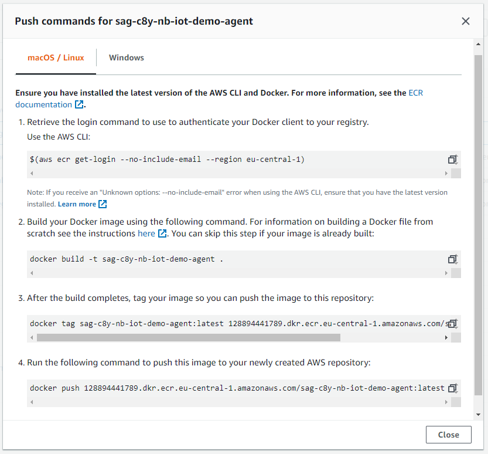
5. open a terminal in [install/docker/dockerfiles/nb-iot-agent](install/docker/dockerfiles/nb-iot-agent) and perform the following commands:
	```bash
	$(aws ecr get-login --no-include-email --region eu-central-1)
	./build.sh
	docker tag sag-c8y-nb-iot-demo-agent:latest 128894441789.dkr.ecr.eu-central-1.amazonaws.com/sag-c8y-nb-iot-demo-agent:latest
	docker push 128894441789.dkr.ecr.eu-central-1.amazonaws.com/sag-c8y-nb-iot-demo-agent:latest
	```
	> ``aws ecr get-login`` will require you to have your credentials set up correctly, ask your administrator for these credentials and configure them using ``aws configure``
6. Remember/copy your image URL, go to your "Task Definitions" and click on "Create new Task Definition":
	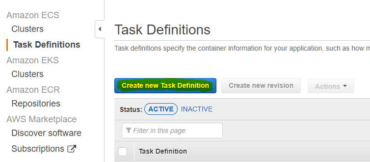
7. Choose "FARGATE" and click "next"
8. Fill in the "Task Definition Name": 'sag-c8y-nb-iot-demo-agent-task', "Task Role": 'ecsTaskExecutionRole, "Task memory" and "Task CPU"
	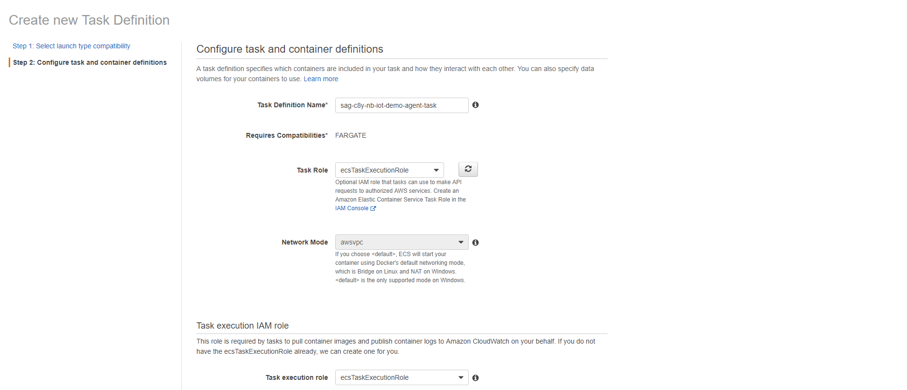
	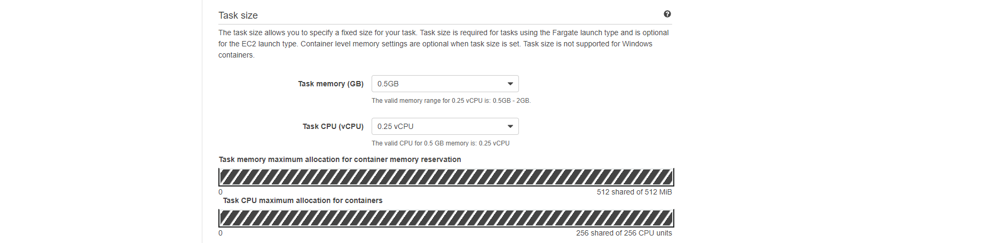
9. Click on "Add container" and fill in the "Container name", "Image", "memory limit"
	```
	sag-c8y-nb-iot-demo-agent-task-definition
	128894441789.dkr.ecr.eu-central-1.amazonaws.com/sag-c8y-nb-iot-demo-agent:latest
	```
	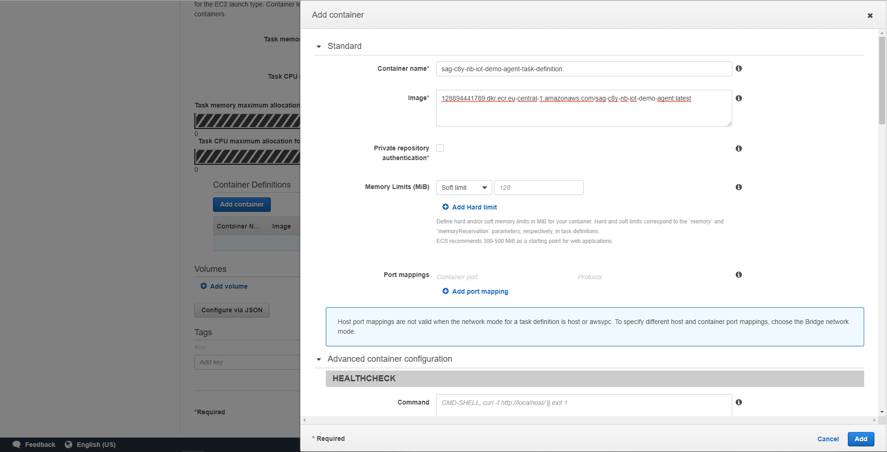
10. Under "Advanced container configuration" go to "ENVIRONMENT" > "Environment variables" and fill in the following variables:
	```
	cumulocity.baseUrl=<your cumulocity tenant url address>
	rabbitmq.hostname=<your rabbitmq ip>
	rabbitmq.username=<your rabbitmq user>
	rabbitmq.password=<your rabbitmq password>
	rabbitmq.vhost=vhost1
	```
	> you can find the rabbitmq.hostname in your cluster > Tasks > the rabbimq task > "Private IP"
	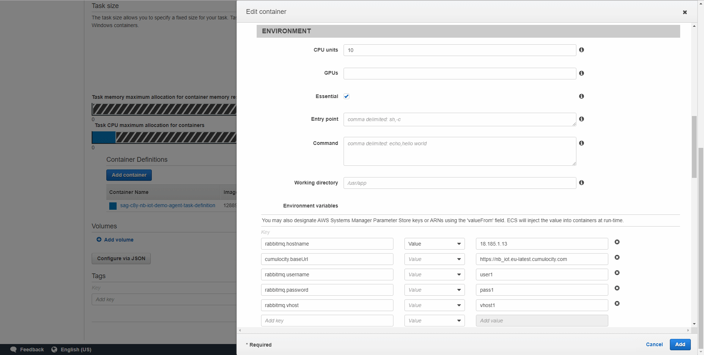
11. Now Click 'Add' to add the container and 'Create' to finish creating the task.
12. Go to your cluster and under "Services" click "Create":  
	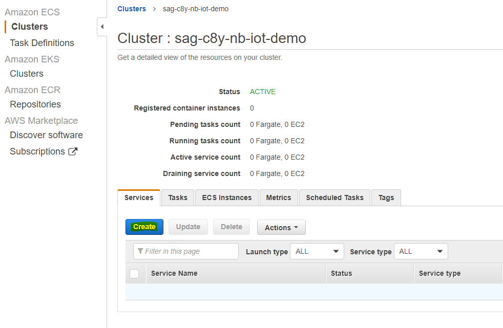
13. configure a new Service and click "next":  
	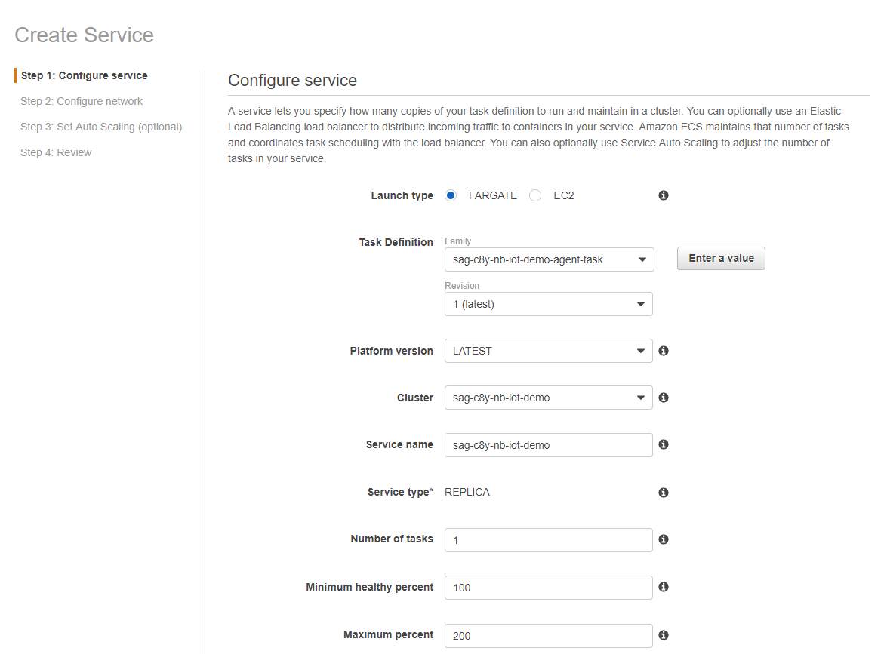
14. configure the network for the service and click "next" untill you "create service":  
	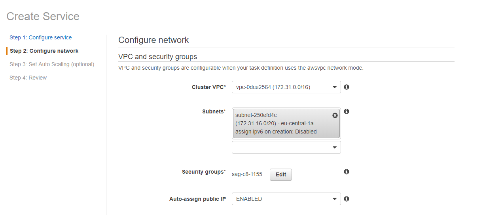
15. Click on "Edit" under "Security groups" and fill in the following information:
	```
	sag-c8y-nb-iot-demo-agent
	Custom-UDP		8888-8888		
	```
	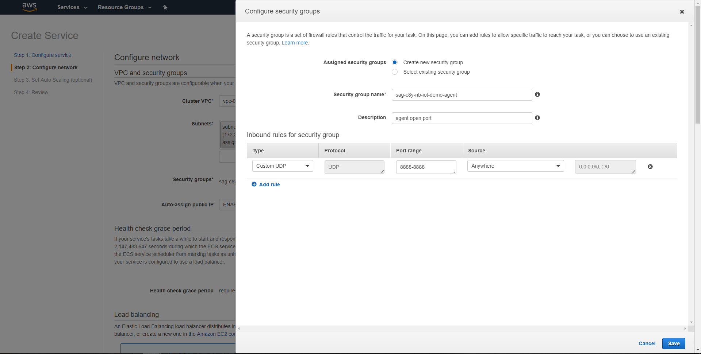
16. uncheck "Enable service discovery integration"
17. spam next and click "Create Service"
	> you can now find the IP by going to your cluster > Tasks > the agent task > "Private IP"
  
[:top:](#)

## RE-Deployment

Either run the script from the [automated section](#automated) again or follow the next steps:
1. run the following commands aquired from the Deployment steps above:
	```bash
	$(aws ecr get-login --no-include-email --region eu-central-1)
	./build.sh
	docker tag sag-c8y-nb-iot-demo-agent:latest 128894441789.dkr.ecr.eu-central-1.amazonaws.com/sag-c8y-nb-iot-demo-agent:latest
	docker push 128894441789.dkr.ecr.eu-central-1.amazonaws.com/sag-c8y-nb-iot-demo-agent:latest
	```
2. Go back to your cluster, "Tasks", select the task with "agent" as definition and click "Stop" on the agent task:  
	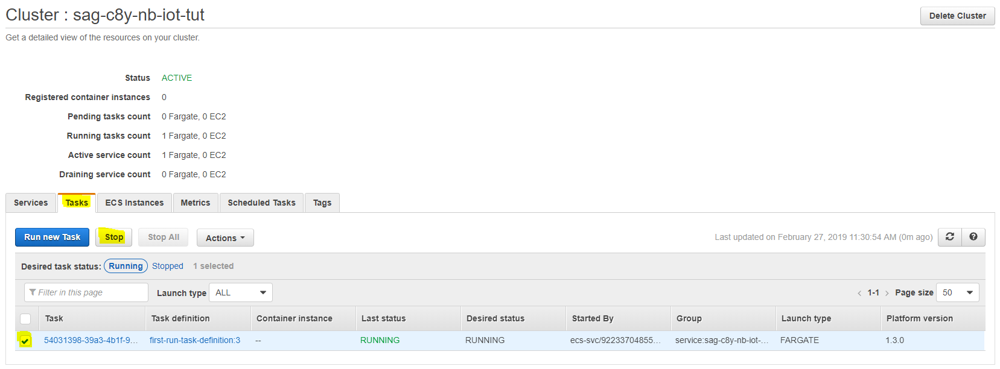
3. Wait a couple of seconds/minutes untill the task restarts, be sure to refresh the page.

### To be noted:
 
Every time you deploy the task, it will be assigned a random IP, which requires the NB-IoT **NODES** to be reconfigured after re-deployment, so **make sure to edit the Device configuration after re-deploying the agent!**.  
  
If you want a static IP you can do this by going to EC2>"Network & Security">"Elastic IPs">"Allocate new address" and setting this up properly. (`https://<region>.console.aws.amazon.com/ecs/home?region=<region>#/clusters/<clustername>/tasks/<task-uuid>/details`)  
  
[:top:](#)
<!-- <wizard> -->
| [&laquo; Back: rabbitmq-broker deployment](../rabbitmq-broker/README.md) | [HOME](/README.md) | [Next: NB_IoT node &raquo;](../../../../src/NB-IoT_node/README.md)
| :----------- | :-----------: | -----------: |
<!-- <\wizard> -->

