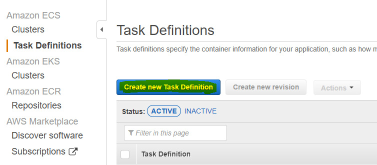
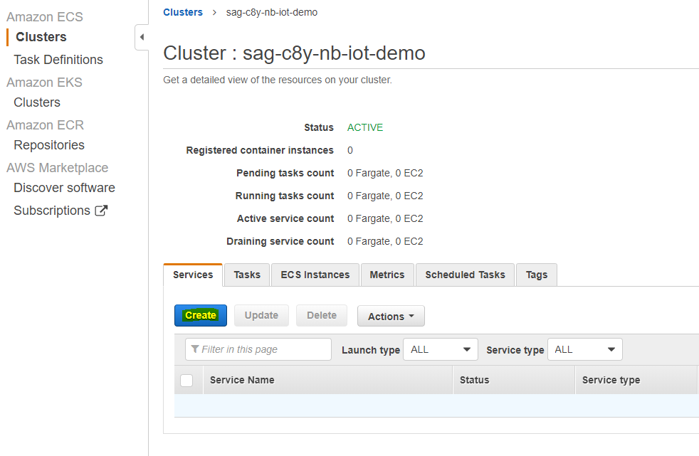

<!-- <wizard> -->
| [&laquo; Back: AWS ECS Cluster setup](../README.md) | [HOME](/README.md) |  [Next: NB-IoT_Agent AWS ECS deployment &raquo;](../nb-iot-agent/README.md)
| :----------- | :-----------: | -----------: |
<!-- <\wizard> -->
# Index
* [RabbitMQ-broker deployment using ECS](#rabbitmq-broker-deployment-using-ecs)
* [RE-Deployment](#re-deployment)
	* [To be noted](#to-be-noted)

# RabbitMQ-broker deployment using ECS
## Automated
Launch [the rabbitmq auto-deploy.sh script](./auto-deploy.sh) (**skip the AWS ECS cluster requirement**: it creates it for you) which creates the AWS ECS cluster, the docker images, repositories, tasks, services and opens webpage to the task running the image. You'll be able to see the public ip and logs (other tab) after clicking on the task itself ("Task", not the "Task definition").  

- Warning: the auto-deploy scripts make use of the default vpc and default subnet. If these don't exist because you're using an old AWS account, a vpc and subnet will be created.  

## Manually	
Follow the following steps to deploy the rabbitmq-broker manually:

1. Go to AWS ECR:  
	
2. Click on "Create Repository":  
	
3. Create a repository 'sag-c8y-nb-iot-demo-rabbitmq-broker':  
	
4. In the repository list click on your repositories and click on "view push commands":  
	
5. open a terminal in [install/docker/dockerfiles/rabbitmq-broker](../../../docker/dockerfiles/rabbitmq-broker) and perform the following commands:
	```bash
	$(aws ecr get-login --no-include-email --region eu-central-1)
	docker build -t sag-c8y-nb-iot-demo-rabbitmq-broker .
	docker tag sag-c8y-nb-iot-demo-rabbitmq-broker:latest 128894441789.dkr.ecr.eu-central-1.amazonaws.com/sag-c8y-nb-iot-demo-rabbitmq-broker:latest
	docker push 128894441789.dkr.ecr.eu-central-1.amazonaws.com/sag-c8y-nb-iot-demo-rabbitmq-broker:latest
	```
	> ``aws ecr get-login`` will require you to have your credentials set up correctly, ask your administrator for these credentials and configure them using ``aws configure``
6. Remember/copy your image URL, go to your "Task Definitions" and click on "Create new Task Definition":
	
7. Choose "FARGATE" and click "next"
8. Fill in the "Task Definition Name": 'sag-c8y-nb-iot-demo-rabbitmq-broker-task', "Task Role": 'ecsTaskExecutionRole, "Task memory" and "Task CPU"
	
	
9. Click on "Add container" and fill in the "Container name", "Image", "memory limit"
	```
	sag-c8y-nb-iot-demo-rabbitmq-broker-task-definition
	128894441789.dkr.ecr.eu-central-1.amazonaws.com/sag-c8y-nb-iot-demo-rabbitmq-broker:latest
	```
	
10. Under "Advanced container configuration" , "ENVIRONMENT", "Environment variables" fill in the following variables:
	```
	RABBITMQ_DEFAULT_USER=<your rabbitmq username>
	RABBITMQ_DEFAULT_PASS=<your rabbitmq password>
	RABBITMQ_DEFAULT_VHOST=vhost1
	```
	
11. Now Click 'Add' to add the container and 'Create' to finish creating the task.
12. Go to your cluster and under "Services" click "Create":  
	
13. Configure a new Service using your rabbitmq-broker task and click "next":  
	
14. Configure the network for the service and click "next" untill you "create service":  
	
15. Click on "Edit" under "Security groups", fill in the following information and press "save"
	```
	sag-c8y-nb-iot-demo-rabbitmq-broker
	Custom-TCP		5672-5672
	```
	
16. uncheck "Enable service discovery integration"
17. spam next and click "Create Service"
	> you can now find the IP by going to your cluster > Tasks > the rabbimq task > "Private IP"
	
[:top:](#)

## RE-Deployment

Either run the script from the [automated section](#automated) again or follow the next steps:
1. run the following commands aquired from the Deployment steps above:
	```bash
	$(aws ecr get-login --no-include-email --region eu-central-1)
	docker build -t sag-c8y-nb-iot-demo-rabbitmq-broker .
	docker tag sag-c8y-nb-iot-demo-rabbitmq-broker:latest 128894441789.dkr.ecr.eu-central-1.amazonaws.com/sag-c8y-nb-iot-demo-rabbitmq-broker:latest
	docker push 128894441789.dkr.ecr.eu-central-1.amazonaws.com/sag-c8y-nb-iot-demo-rabbitmq-broker:latest
	```
2. Go back to your cluster, "Tasks", select the task with "rabbitmq-broker" as definition and click "Stop" on the rabbitmq-broker task:  
	
3. Wait a couple of seconds/minutes untill the task restarts, be sure to refresh the page.

### To be noted:

Every time you deploy the task will be assigned a random IP, if you want a static ip you can do this by going to EC2>"Network & Security">"Elastic IPs">"Allocate new address" and setting this up properly. (`https://<region>.console.aws.amazon.com/ecs/home?region=<region>#/clusters/<clustername>/tasks/<task-uuid>/details`)  
> Be sure to edit the Agent configuration after re-deploying the rabbitmq-broker
  
[:top:](#)
<!-- <wizard> -->
| [&laquo; Back: AWS ECS Cluster setup](../README.md) | [HOME](/README.md) |  [Next: NB-IoT_Agent AWS ECS deployment &raquo;](../nb-iot-agent/README.md)
| :----------- | :-----------: | -----------: |
<!-- <\wizard> -->
