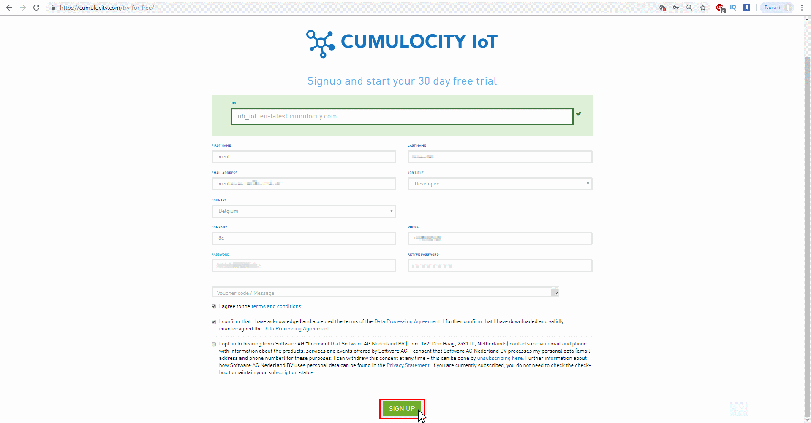
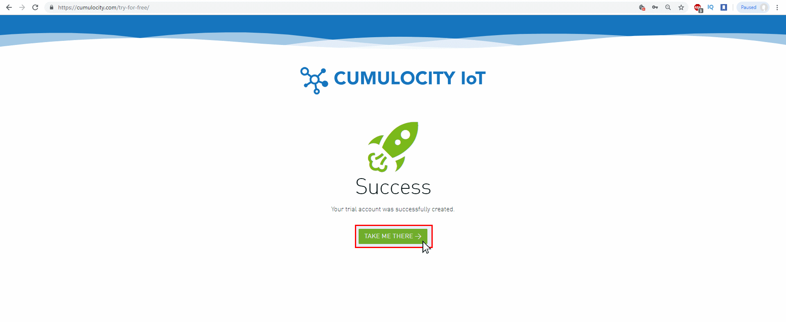
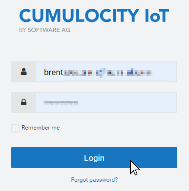

<!-- <wizard> -->
| [&laquo; Back: DevelopmentDesktop](../developmentDesktop/README.md) | [HOME](/README.md) |  [Next: NB-IoT_agent &raquo;](../../src/NB-IoT_agent/README.md) |
| :----------- | :-----------: | -----------: |
<!-- <\wizard> -->
# Cumulocity (trial) Tenant
A cumulocity tenant is required for this project in order to be able to store and visualise the measurements on a webpage.  
You can find out how to create a new (trial) tenant in the following steps:
1. Go to [cumulocity.com](https://www.cumulocity.com) (redirects you) and click on "Try For Free"  
	  
2. Fill in your information and click on "SIGN UP"  
	  
	> Make sure you use the full url from the url box in your agent configuration.  
3. Click on "TAKE ME THERE"  
	  
4. Log in using your credentials.  
	  
	> Make sure you are logged out of other cumulocity tenants!  
  
<!-- <wizard> -->
| [&laquo; Back: DevelopmentDesktop](../developmentDesktop/README.md) | [HOME](/README.md) |  [Next: NB-IoT_agent &raquo;](../../src/NB-IoT_agent/README.md) |
| :----------- | :-----------: | -----------: |
<!-- <\wizard> -->
