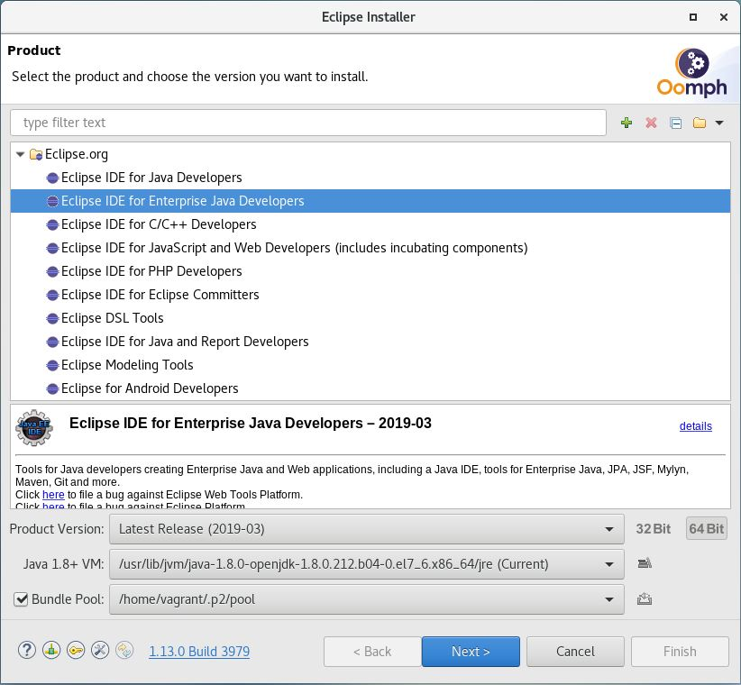

<!-- <wizard> -->
| [&laquo; Back: home](/README.md) | [HOME](/README.md) |  [Next: CumulocityTenant &raquo;](../cumulocityTenant/README.md) |
| :----------- | :-----------: | -----------: |
<!-- <\wizard> -->
# Index
 * [Introduction](#introduction)
 * [Usage](#usage)
	* [Prerequisites](#prerequisites)
 * [Vagrant](#vagrant)
	* [Introduction](#introduction)
	* [Pre-requisites](#pre-requisites)
	* [Basics](#basics)
	* [Known issues](#known-issues)
		* [VirtualBox Guest Additions installation fails](#virtualBox-guest-additions-installation-fails)
		* [Copy/Paste from guest to host or vice versa via clipboard doesn't work](#copypaste-from-guest-to-host-or-vice-versa-via-clipboard-doesnt-work)
		* [Mouse input on the graphical user interface of the vm stops working](#mouse-input-on-the-graphical-user-interface-of-the-vm-stops-working)
 * [Integrated Development Environments (IDE)](#integrated-development-environments-ide)
	* [Java](#java)

# Introduction
This folder contains the dependencies for the [Vagrantfile](../../VagrantFile) in the root folder of this project. This Vagrantfile allows you to setup a development Desktop environment to build the solution, as a VirtualBox VM running CentOS.  
  
[:top:](#)

# Usage
## Prerequisites
Make sure you have installed the following utilities before continuing:  
1.  [Oracle VirtualBox v5.2.22 (or higher)](https://www.virtualbox.org/wiki/Download_Old_Builds_5_2#v22)
2.  [Vagrant v2.2.2 (or higher)](https://releases.hashicorp.com/vagrant/2.2.2/)
3.  [Git](https://git-scm.com/book/en/v2/Getting-Started-Installing-Git)
	> Make sure you update git if you currently have a version below 2.16! (2.16 adds a new and safer way to record CRLF/LF eol conversions!)
4.  Bash: this shell is standard available on Linux and MacOS. On Windows it should automatically be installed together with Git for Windows
  
[:top:](#)

These utilities are free and available on all major operating systems. You can install the latest version of each component. It provides an easily reproducible and portable environment that can be used to build, maintain and run this project.
  
Once these tools are installed, open a bash command line box on your laptop and clone this project in a folder of your choice by executing the following command:  

```sh
git clone https://github.com/I8C/sag-c8y-nb-iot-demo.git
```

# Vagrant
## Introduction
Vagrant is a tool for building and managing virtual machine environments in a single workflow. Within i8c it is especially useful for:
- creating a developer or demo environment running one of the integration platforms we support, because it allows you to completely automate and reproduce the installation from a single configuration file
- simplifying the upgrade of your environment when a new release is available of the integration platform that you are using, by quickly reacreating it with the latest installation binaries
- sharing virtual machines with your colleagues more efficiently because you don't have to centrally store the complete virtual machine (which saves storage space) and it also allows to share the installation details of your environment
  
An example of such a Vagrant project can be found [here](https://gitlab.com/i8c/sag/sag-infra-vagrant).  
  
[:top:](#)


## Pre-requisites
Vagrant can be used with multiple VM providers that need to be installed on your laptop before you can build a VM using Vagrant. Please use Oracle VirtualBox on your laptop, because it's free and available on all major operating systems. It can be downloaded [here](https://www.virtualbox.org/wiki/Downloads). Please install the latest version. This version of the project was created with v5.2.2. If you are completely new to Virtual Machines and VirtualBox, check the [User Manual](https://www.virtualbox.org/manual/UserManual.html) first.
  
[:top:](#)

## Basics

Read the [tutorial on the offical Vagrant website](https://www.vagrantup.com/intro/getting-started/index.html), including all the subsections (Install, Project Setup,...). It explains the basic concepts and how you can install the tool on your laptop. Please install the latest version. This version of the project was created with v2.2.2.

    	
1.  Download and start the VM by executing the following command:  
    
    ```sh
    vagrant up &> vagrant.log &
    tail -f vagrant.log
    ```
    
    Don't login to your machine as long as it only shows a command line terminal. Wait for it to finish its installation of the graphical shell. This can take some time. You can check the progress on the command line of your laptop.
    
2.  Login to your machine

    Once your the graphical shell in your VM is visible you can login using the user "vagrant" with password "vagrant". Note that the keyboard layout has been changed by Vagrant to Belgian azerty when you enter the password. If this would not be correct, you will be able to change the keyboard layout upon first login. Once you have logged in, you can also change the password by clicking the icons in the upper right corner of the screen, click the tools icon and select 'Region & Language' -> 'Input Sources'. In the windows that appears click on the "+" sign to add your keyboard as a new input source. After adding your input source, you can remove incorrect input sources. 
  
[:top:](#)

## Known issues
### VirtualBox Guest Additions installation fails
The centos/7 vagrant box used in this exercise is officialy supported by Centos and frequently updated on the vagrant cloud (monthly releases). Vagrant downloads and uses the latest centos box version when you first run your instance. At the time of writing, the latest version was 1803.01. The Vagrantfile also uses the vagrant vbguest plugin to install the VirtualBox Guest Additions (VBGA) that match the version of your VirtualBox installation. The vbguest plugin tries to install the latest kernel header files to install VBGA on your CentOS VM. If you would run into issues when installing VBGA or related functionality, make sure you are using the latest version of all components involved (Vagrant, VirtualBox, CentOS box).  
If you still fail to install the VirtualBox Guest Additions after updating all components to the latest version, check your `vagrant.log` for the following errors:  
  
```sh
VirtualBox Guest Additions: Building the VirtualBox Guest Additions kernel modules.
This system is currently not set up to build kernel modules.
Please install the Linux kernel "header" files matching the current kernel
for adding new hardware support to the system.
The distribution packages containing the headers are probably:
    kernel-devel kernel-devel-3.10.0-693.21.1.el7.x86_64
An error occurred during installation of VirtualBox Guest Additions 5.2.12. Some functionality may not work as intended.
```
  
This error will probably be preceded by:
  
```sh
Loaded plugins: fastestmirror
Determining fastest mirrors
 * base: xxx
 * extras: xxx
 * updates: xxx
No package kernel-devel-3.10.0-693.21.1.el7.x86_64 available.
```
  
This problem seems to be caused by the yum repos (base, extras, updates), whose major version symlink (7 in the example that follows) already points to a higher minor version while your box expects a lower minor version. For example http://mirror.centos.org/centos/7/ can point to http://mirror.centos.org/centos/7.5.1804/ while your box expects to find the content of http://mirror.centos.org/centos/7.4.1708/. This typically occures when the latest Centos Vagrant box is not yet updated to the latest Centos binaries with a higher version.
  
To fix this issue, connect to your vagrant instance with ssh and update your environment manually:
  
```sh
vagrant ssh
[vagrant@localhost ~]$ sudo yum -y update
[vagrant@localhost ~]$ exit
vagrant reload
```
  
Reload your VM to make sure the kernel is upgraded. You can check this using the uname command:
  
```sh
# Before reload
[vagrant@localhost ~]$ uname -a
Linux localhost.localdomain 3.10.0-693.21.1.el7.x86_64 #1 SMP Wed Mar 7 19:03:37 UTC 2018 x86_64 x86_64 x86_64 GNU/Linux
```
```sh
# After reload
[vagrant@localhost ~]$ uname -a
Linux localhost.localdomain 3.10.0-862.2.3.el7.x86_64 #1 SMP Wed May 9 18:05:47 UTC 2018 x86_64 x86_64 x86_64 GNU/Linux
```
  
[:top:](#)

### Copy/Paste from guest to host or vice versa via clipboard doesn't work
First of all note that the copy/paste feature between your host and the CentOS guest running in VirtualBox only works for plain text.  
If this feature is not working, try the following from the command line of your host where the Vagrantfile is located to enable this feature:  
```sh
vagrant vbguest --do install
vagrant reload
```  
This will reinstall the VirtualBox Guest Additions. Make sure your desktop software and the latest updates have been installed, so that the VirtualBox Guest Additions are compiled and linked correctly.
  
[:top:](#)

### Mouse input on the graphical user interface of the vm stops working
Simply logging out and logging back in should resolve this issue.
  
[:top:](#)

# Integrated Development Environments (IDE)

## Java
The Java IDE of choice is Eclipse. Perform the following steps to finalize the installation:
    
1.  Execute the Eclipse installer /opt/eclipse/eclipse-installer/eclipse-inst. Select Advanced Mode from the menu in the upper right corner and wait for the Eclipse installer to restart.  
    
      
    
2.  Select Eclipse IDE for Java EE Developers (product version 2019-03 or higher) and click next:  
    
      
    
3.  Click the green plus sign to add the [Google Java Coding Standard](https://google.github.io/styleguide/javaguide.html) project settings in /vagrant/install/developmentDesktop/googleJavaCodingStandard.setup as a Github Project  
    
      
    
4. Select the newly created project and click next
    
      
    
5. Choose an installation folder name and click next
    
      
    
6. Click finish to start the installation process. Accept any popus that appear.
    
      
    
        
When the installation finishes Eclipse will automatically be started.
  
[:top:](#)
<!-- <wizard> -->
| [&laquo; Back: home](/README.md) | [HOME](/README.md) |  [Next: CumulocityTenant &raquo;](../cumulocityTenant/README.md) |
| :----------- | :-----------: | -----------: |
<!-- <\wizard> -->
