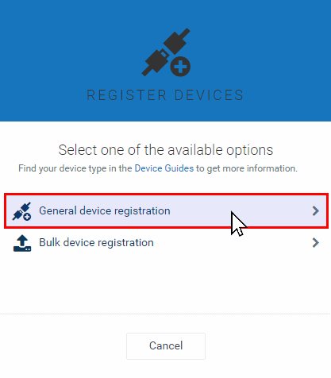

<!-- <wizard> -->
| [&laquo; Back: NB_IoT node](../../src/NB-IoT_node/README.md) | [HOME](/README.md) |
| :----------- | :-----------: |
<!-- <\wizard> -->
# Index
 * [Registering a Device on Cumulocity](#registering-a-device-on-cumulocity)
	 * [Requirements](#requirements)
	 * [Registration Steps](#registration-steps)
  
# Registering a Device on Cumulocity

## Requirements: 

Before you can register devices on Cumulocity, the steps below have to be performed successfully:

* [Setup a working cumulocity tenant](../cumulocityTenant/README.md)
* [Setup a running rabbitmq instance](../aws/ecs/rabbitmq-broker/README.md)
* [Setup a running agent instance](../aws/ecs/nb-iot-agent/README.md)
* [Setup a running node](../../src/NB-IoT_node/README.md)
  
[:top:](#)

## Registration steps:
1. On your Cumulocity tenant page, go to "Device management"  
	
2. Click on "Register device"  
	
3. Click on "General Device Registration"  
	
4. Enter the device IMEI (can be found on a sticker on the SARA-N211 module) and click "Next" and "Complete"  
	
5. You'll see your device "WAITING FOR CONNECTION"  
	
6. Wait until the communication with the device is successfull "PENDING ACCEPTANCE" and click the "accept" button  
	
7. Click on "All Devices" under "Devices"  
	
8. Click on your newly created device (device_ + number part)  
	
9. You can now view the device measurements!  
	
  
[:top:](#)
<!-- <wizard> -->
| [&laquo; Back: NB_IoT node](../../src/NB-IoT_node/README.md) | [HOME](/README.md) |
| :----------- | :-----------: |
<!-- <\wizard> -->
