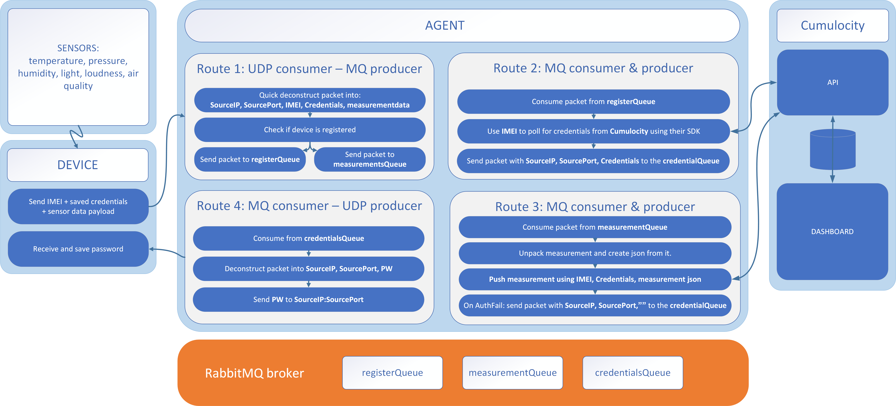

<!-- <wizard> -->
| [&laquo; Back: Cumulocity tenant](../../install/cumulocityTenant/README.md) | [HOME](/README.md) |  [Next: NB_IoT node &raquo;](../NB-IoT_node/README.md)
| :----------- | :-----------: | -----------: |
<!-- <\wizard> -->

# Index
 * [NB_IoT-Agent](#nb-iot-agent)
	 * [Technologies used](#technologies-used)
	 * [Issues](#issues)
	 * [Requirements](#requirements)
	 * [Deployment](#deployment)

# NB_IoT-Agent

This java project will listen for UDP packets from the NB-IoT node and process them using 4 routes:


> note: route 1 and route 4 HAS to run inside the same container! Route 2 and 3 can be moved to separate containers.

## Technologies used:

 * springframework
 * apache camel
 * camel-netty4
 * camel-rabbitMQ
 * cumulocity sdk
  
The source code in this folder can be build with Maven, which has been installed on the Development Desktop via the Vagrantfile. You can use the [Eclipse IDE](../../install/developmentDesktop/README.md#java) to edit and build the source code. Just import the code as a Maven project into Eclipse.
  
  
[:top:](#)

## Requirements
To run the code, you need
1) A Cumulocity tenant

	see [install/cumulocityTenant/README.md](../../install/cumulocityTenant)
	
2) A running RabbitMQ instance
	  
	RabbitMQ is deployed using a modified version of the standard RabbitMQ Docker image, which can be build and run (for local testing) on the Developement Desktop as follows:
	```bash
	cd /vagrant/install/docker/dockerfiles/rabbitmq-broker
	./build.sh
	./runLocal.sh
	```
Docker has been installed on the Develomment Desktop via the Vagrantfile.  
  
The connections parameters for both requirements need to be configured in [src\main\resources\application.properties](./src/main/resources/application.properties). This file requires the following parameters (replace the <...>):  
  
```
# Cumulocity properties
cumulocity.baseUrl = <your cumulocity tenant web address>
cumulocity.bootstrapUsername = devicebootstrap
cumulocity.bootstrapPassword = Fhdt1bb1f
	
# rabbitmq properties
rabbitmq.hostname = <your mq broker ip address>
rabbitmq.username = user1
rabbitmq.password = pass1
rabbitmq.vhost = vhost1
```
	> It is also possible to use environment variables when running this agent in a docker container  
	> Make sure to create the environment variables in your ECS instance task definition when running on AWS ECS  
	> read up on that in [install/aws/ecs/nb-iot-agent#deployment step 10.](install/aws/ecs/nb-iot-agent#deployment) 

[:top:](#)

## Deployment
The NB-IoT_Agent needs to be publically accessible from the internet. Therefore we chose to deploy it on Amazon Web Services, but other Cloud platforms (Microsoft Azure, Google Cloud, ...) can also be used.  
  
Deployment can be performed:
- Automated: using the scripts within this project executed from the Development Desktop Vagrantbox
- Manually: via the AWS web console in your browser
  
### [What is AWS ECS & how do i set it up?](../../install/aws/ecs/README.md)
### Pre-requisites
#### Automated Deployment
* AWS client: has already been installed on the Development Desktop via the Vagrantfile. You only need to configure it to connect to your account:  
  
```bash
AWS Access Key ID [None]: xxx
AWS Secret Access Key [None]: xxx
Default region name [None]: eu-central-1
Default output format [None]:
```
  
All scripts assume the default region is `eu-central-1`. You can select another region, but keep in mind to check the scripts used in the rest of deployment the instructions.  
  
#### Manual Deployment
This deployment type assumes all the required AWS Services are created manually via the AWS Web console. Open your browser, navigate to the AWS console and login with your AWS account. Then perform the steps below and the other Manual deployment section in the instructions below and the next section.  
  
* [An AWS ECS cluster](../../install/aws/ecs/README.md)  
	An aws ecs cluster is required to run the service which will run the tasks:
	- agent
	- rabbitmq-broker
	> the same aws cluster can be used for both the rabbitmq-broker and the agent.
  
### Deploy and run the RabbitMQ Broker and NB IoT Agent	
1) First the RabbitMQ broker needs to be deployed for the agent container to function properly, so start [a running rabbitmq-broker on AWS ECS first](../../install/aws/ecs/rabbitmq-broker/).  
  
2) Then, [deploy the agent using ECS](../../install/aws/ecs/nb-iot-agent).
  
[:top:](#)
<!-- <wizard> -->
| [&laquo; Back: Cumulocity tenant](../../install/cumulocityTenant/README.md) | [HOME](/README.md) |  [Next: NB_IoT node &raquo;](../NB-IoT_node/README.md)
| :----------- | :-----------: | -----------: |
<!-- <\wizard> -->
