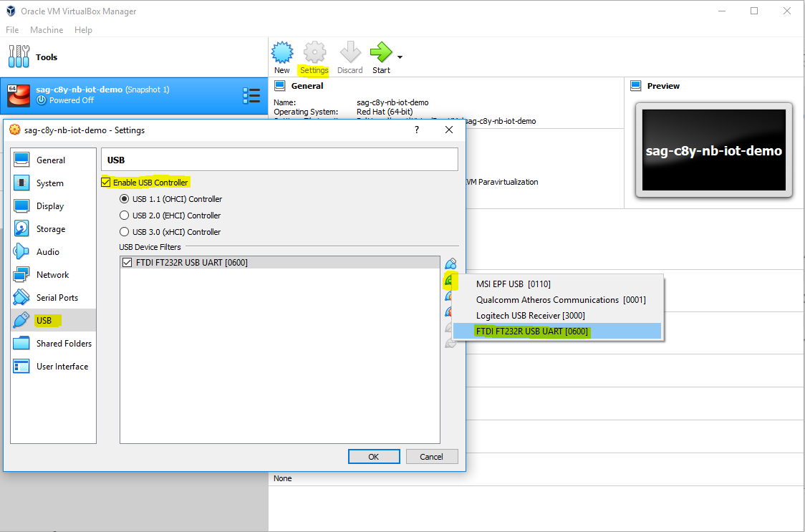

<!-- <wizard> -->
| [&laquo; Back: NB-IoT_Agent](src/NB-IoT_agent) | [HOME](/README.md) |  [Next: Register devices on Cumulocity &raquo;](/install/deviceRegistration)
| :----------- | :-----------: | -----------: |
<!-- <\wizard> -->
# Index
 * [NB-IoT_node](#nb-iot-node)
	 * [Sodaq deployment](#sodaq-deployment)
		 * [Add SODAQ to device list](#add-sodaq-to-device-list)
		 * [Upload program to sodaq](#upload-program-to-sodaq)
	 * [Node configuration](#node-configuration)
	 * [Options on how to update "Over The Air"](#how-can-it-be-updated-over-the-air)
	 * [Sources](#sources)

# NB-IoT_node
The SODAQ board running [this code](./NB-IoT_node.ino) will:

 1. Make connection to the Agent on aws.
 2. Get credentials from Cumulocity via the Agent and use them for communication.
 3. Read out the sensors every x seconds.
 4. Create a packet filled with the sensordata.
 5. Send the packet to the server in the configured format.

## Sodaq deployment

**Prerequisites**
 * Arduino IDE is successfully installed (There should be a shortcut on this vagrant box's desktop.)
 * The sodaq mbili is connected to your pc via USB (Don't forget to turn on the board! )
 * You have made a USB passthrough from your host pc to vbox.  (Do this before you start the vagrant box!)

### Add SODAQ to device list

 1. Open **NB-IoT_node.ino** in this directory. This should open the arduino IDE.
 2. Execute `./copyLibScript` to copy the libraries from this directory to the right arduino libraries directory. This script will also rename "Arduino.h" to "arduino.h" (Linux does care about caps!) and give permission to tty0.
 3. Follow the steps (2-5) on [this "get started" tutorial](http://support.sodaq.com/sodaq-one/getting-started/) to add the SODAQ board to the arduino IDE.
 4. Follow the steps in the [Arduino linux guide](https://www.arduino.cc/en/Guide/Linux) to make communication with the board possible.
  
> The serial monitor runs on 57600 baud, not 9600  
> Be sure to have the sodaq board DISconnected from the computer while starting the vagrant box to prevent it from crashing!

### Upload program to sodaq
 
 * You should now be able to upload this program to the sodaq board by clicking **Upload**.

## Node configuration:

 1. Open the **NB-IoT_node.ino** in the arduino IDE.
 2. Edit the server and port to be the serverip and port where your agent is running on.
 3. Upload the program to the device and make sure your agent is running.
 
## How can it be updated "Over The Air"?
This is a future enhancement/feature. Read more about it [here](ArduinoATMEGA1284P.md)

## Sources:

* Sensors:  
https://www.seeedstudio.com/TPH-board-rev-4-p-2483.html  
https://www.seeedstudio.com/Grove-Air-quality-sensor-v1-3-p-2439.html  
https://www.seeedstudio.com/Grove-Light-Sensor-v1-2-p-2727.html  
http://wiki.seeedstudio.com/Grove-Loudness_Sensor  
http://wiki.seeedstudio.com/Grove-PIR_Motion_Sensor  

* nb-iot library:  
using ATT nbiot library: https://github.com/allthingstalk/arduino-nbiot-sdk  
with parts of https://github.com/SodaqMoja/Sodaq_nbIOT to be able easely read received data.  
modified/fixed using http://support.sodaq.com/sodaq-one/at/  
  
* nb-iot node fixes/'hacks':  
static char* fix: http://forum.arduino.cc/index.php?topic=63659.msg463025#msg463025  
saving/loading EEPROM: https://www.norwegiancreations.com/2017/02/using-eeprom-to-store-data-on-the-arduino/  
  
* nb-iot future software-update feature will require:  
https://support.sodaq.com/sodaq-one/creating-a-datalogger/  
  
[:top:](#)
<!-- <wizard> -->
| [&laquo; Back: NB-IoT_Agent](src/NB-IoT_agent) | [HOME](/README.md) |  [Next: Register devices on Cumulocity &raquo;](/install/deviceRegistration)
| :----------- | :-----------: | -----------: |
<!-- <\wizard> -->